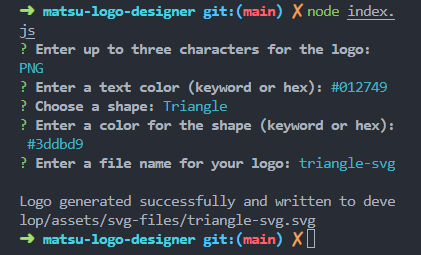

# SVG Generator 
### .matsu.
##### A utility for that rare case you need to design an extremely simple SVG.

## ⇁ Table of Contents
#### * [Demo](#-Demo)
#### * [Getting Started](#-Getting-Started)
#### * [Sources & Materials](#-Sources-&-Materials)
#### * [Contribution](#-Contribution)
#### * [Contact](#-Contact)
#### * [License](#-License)

## ⇁ Demo
Below is a walkthrough video and screenshot examples of how to use the application for the user to get started.

#### Walkthrough Video
A demonstration video can be accessed through Google Drive here: [User Guide (Video)](https://drive.google.com/file/d/1LIuv9HyF5SUbEl1e5KphxzoKzrusWnlM/view?usp=sharing).

#### User Examples
###### CLI Prompts & SVGs:
| | | |
|:-------------------------:|:-------------------------:|:-------------------------:|
|   |  ||
|  |  ||

## ⇁ Getting Started
#### Installation
After installing Node.js on your system, follow the below steps:

1. Clone the repo.
2. Navigate to project directory.
3. Use commands `npm install` or `npm install -y` to install required dependencies.

#### Usage
Use command `node index.js` from the CLI. The application will prompt for user input for logo text, text color, logo shape, shape color, and file name. The generated SVG file can be found in the 'svg-files' subfolder.

## ⇁ Sources & Materials
##### ChatGPT 4 -
Suggestions on alternate file naming logic for `setFileName()`, particularly filtering, mapping, and sorting for the `logoNumbers` variable.
(https://chat.openai.com/)

##### [Ileriayo Adebiyi](https://github.com/Ileriayo)
Tool badge text, colors, and links adapted from their Markdown License Badges repo.
(https://github.com/Ileriayo/markdown-badges.git)

##### [Lukas Himsel](https://gist.github.com/lukas-h) -
License badge text, colors, and links adapted from their Markdown License Badges repo.
(https://gist.github.com/2a5d00690736b4c3a7ba.git)

##### Node.js
JavaScript framework used for this application.
(https://nodejs.org/en)

##### Screencastify -
Software used to record demo video (featured in this readme).
(https://www.screencastify.com/)

## ⇁ Contribution
This project is officially public source. You are welcome to submit an issue or contribute through PRs, but please be aware that I will not be actively giving attention to this project.

## ⇁ Contact
For questions about the SVG Generator or other concerns, please reach out to Jus via email.
* Email: [jdferrell@ucsd.edu](jdferrell@ucsd.edu)
* GitHub: [lifeofmatsu](https://github.com/lifeofmatsu)

## ⇁ License

Copyright (c) 2023 Jus Ferrell

